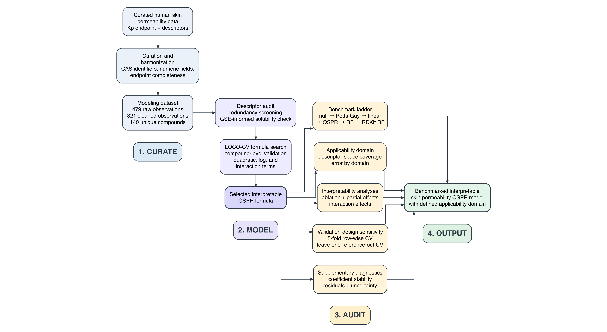
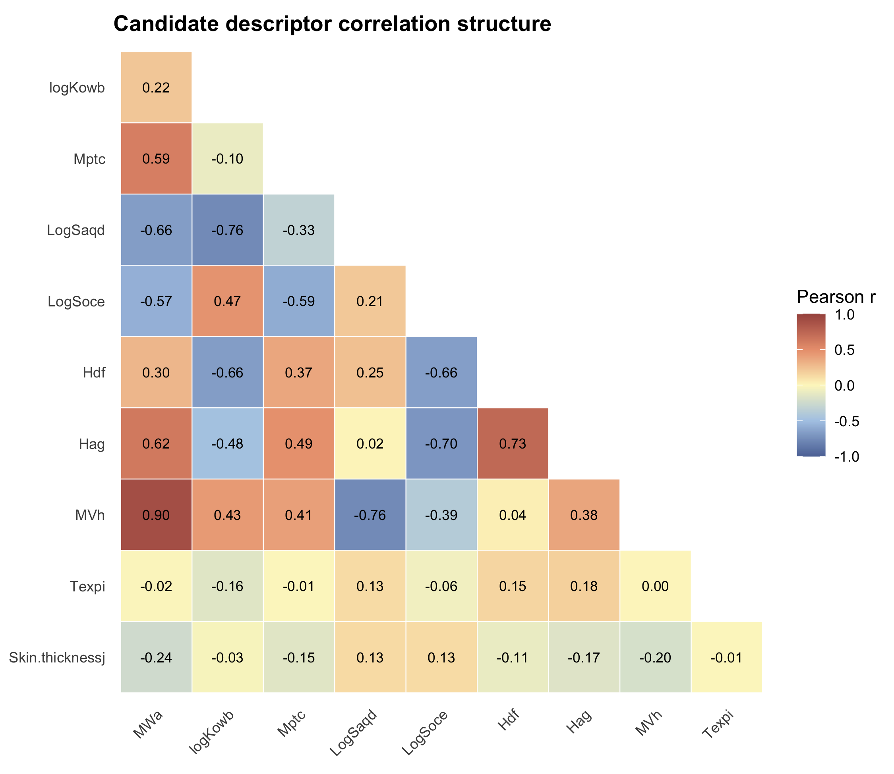
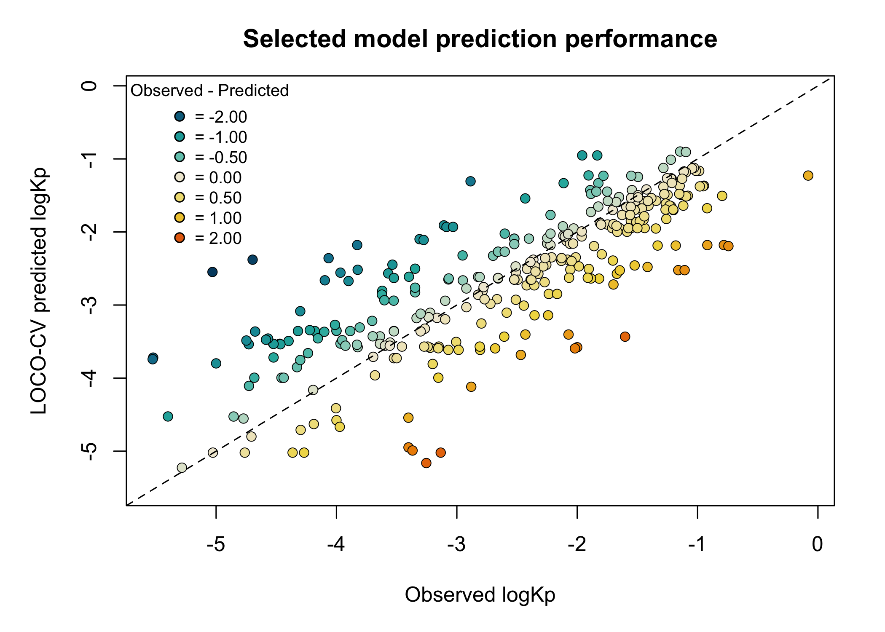
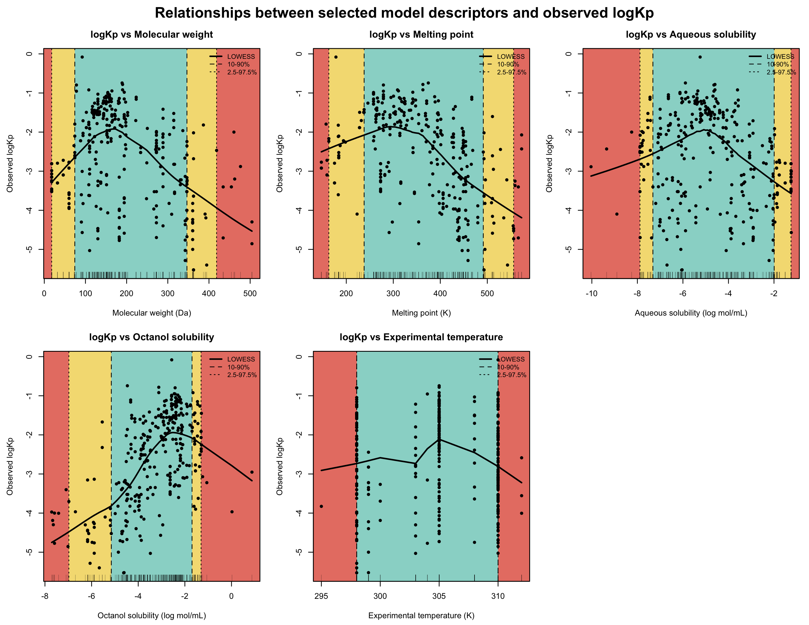
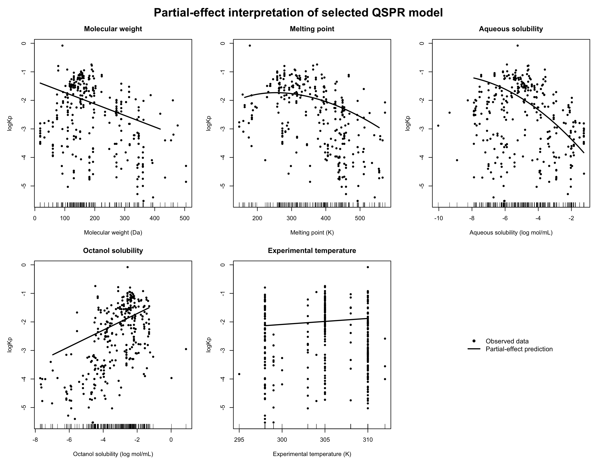
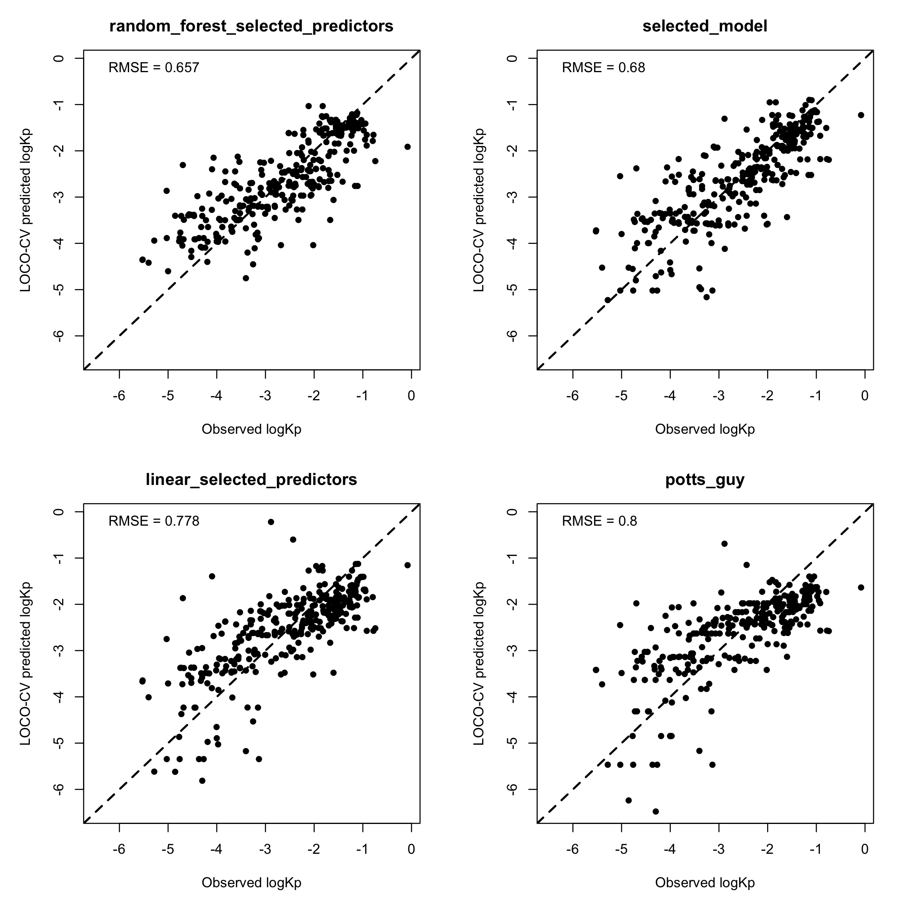

```{r setup, include=FALSE}
knitr::opts_chunk$set(
	echo = FALSE,
	warning = FALSE,
	message = FALSE,
	fig.align = "center",
	fig.width = 7,
	fig.height = 5,
	out.width = "75%"
)

repo_root <- ".."
p <- function(...) file.path(repo_root, ...)

cleaning_flow_path <- p(
	"results",
	"cleaning",
	"cleaning_flow.csv"
)

if (!file.exists(cleaning_flow_path)) {
	stop(
		"Missing cleaning-flow table: ",
		cleaning_flow_path,
		"
Run R/01_clean_data.R before rendering the manuscript.",
		call. = FALSE
	)
}

cleaning_flow <- read.csv(
	cleaning_flow_path,
	stringsAsFactors = FALSE
)

final_row <- cleaning_flow[
	cleaning_flow$step == "Final modeling dataset",
	,
	drop = FALSE
]

if (nrow(final_row) != 1) {
	stop(
		"Expected exactly one 'Final modeling dataset' row in cleaning_flow.csv.",
		call. = FALSE
	)
}

final_observations <- final_row$observations
final_compounds <- final_row$unique_compounds
```

# Abstract

Skin permeability prediction is important for evaluating transdermal exposure, topical delivery, and compound screening, but reported permeability values are influenced by both molecular properties and experimental context. This study develops an interpretable QSPR workflow for human skin permeability using a curated literature-derived dataset.

The central model is a transparent parametric QSPR model selected under compound-level cross-validation. Its performance is compared with classical empirical baselines, linear benchmark models, random forest models, and RDKit-derived descriptor benchmarks. Descriptor redundancy and applicability-domain analyses are used to support cautious interpretation and define the limits of model use.

<add results>

This work aims to provide not only a predictive model for human skin permeability, but also an auditable modeling framework for heterogeneous literature-curated permeability datasets.

# Keywords

Skin permeability; QSPR;

# Introduction

Skin permeability prediction is challenging because permeability is not determined by compound structure alone. Passive transport across skin is strongly constrained by the stratum corneum, a heterogeneous lipid-rich barrier that controls partitioning and diffusion [@potts1992predicting; @chen2013hydrophilic]. Reported permeability values are also shaped by formulation and experimental context, including vehicle composition, exposure conditions, membrane source, and assay design, all of which can influence solubility and partitioning into the skin barrier [@karadzovska2013vehicles; @chedik2024update]. Computational models therefore need to represent molecular and physicochemical determinants while remaining aware that the measured endpoint also contains experimental-context variation.

Experimental skin permeability is commonly measured using in vitro diffusion systems, including Franz diffusion cells, excised human or animal skin, reconstructed skin models, and membrane-based surrogate assays [@oecd2004tg428; @neupane2020alternatives; @jacobi2005comparison]. These assays provide direct empirical estimates of permeability or flux, but they are resource-intensive and difficult to scale across large chemical libraries. Measurements depend not only on the compound itself, but also on membrane source, donor and receptor conditions, vehicle, exposure duration, analytical method, and endpoint definition. As a result, literature-derived permeability values combine molecular signal with substantial experimental-context variation [@karadzovska2013vehicles; @mitragotri2011mathematical].

Curated skin-permeability datasets provide an attractive basis for computational modeling because they aggregate reported measurements and descriptors across many compounds and studies. The dataset used in the present study was compiled from published in vitro human skin permeation reports and includes permeability coefficients, maximum flux values, physicochemical descriptors, and experimental-condition variables for drugs, xenobiotics, and other solutes applied from aqueous solutions [@cheruvu2022updated]. However, such datasets are not simple collections of independent compound-level observations. They often contain repeated measurements for the same compound, variable exposure times, inconsistent experimental conditions, and descriptors obtained or harmonized from multiple chemical information sources. These properties increase chemical and experimental coverage, but they also create risks for model fitting, interpretation, and validation.

Classical skin-permeability equations established an important physicochemical foundation for prediction. The Potts--Guy relationship showed that skin permeability could be approximated using molecular weight and octanol--water partitioning, providing a simple empirical model that remains widely used as a reference equation [@potts1992predicting]. Related empirical models and later refinements similarly emphasized the importance of molecular size, lipophilicity, hydrogen-bonding capacity, and partitioning behavior in percutaneous absorption [@potts1995predictive; @moss2002qspr; @patel2002qsar]. These models remain useful because they are transparent and easy to interpret. They also reflect core principles of skin transport, including partitioning into lipid-rich stratum-corneum domains, diffusion through the barrier, solubility constraints, and, depending on the assay, vehicle-dependent transport behavior.

Skin-permeability modeling has since developed through several overlapping traditions. Empirical equations such as the Potts--Guy model provided simple relationships between permeability, molecular weight, and octanol--water partitioning [@potts1992predicting]. Subsequent QSAR and QSPR studies expanded this approach using datasets compiled from the skin-permeability literature, including the Flynn dataset and later human-skin permeability compilations, and tested additional descriptors such as melting point, molecular volume, hydrogen-bonding descriptors, polar surface area, solubility, and ionization-related terms [@flynn1990physicochemical; @lian2008evaluation; @tsakovska2017quantitative]. Other studies adopted nonlinear or machine-learning approaches, including artificial neural networks, support vector machines, random forests, hierarchical support vector regression, fragment-contribution models, and RDKit-style cheminformatics descriptor sets [@pecoraro2019computational; @stepanov2020huskindb; @waters2022huskindb; @waters2023fragment; @wu2022twoqsar]. In parallel, mechanistic and semi-mechanistic models have represented skin transport using diffusion, partitioning, compartmental, or microstructure-based descriptions [@mitragotri2011mathematical; @karadzovska2013vehicles]. Together, this literature shows that skin permeability can be modeled from chemical and experimental information, but it also shows that reported performance depends strongly on dataset curation, descriptor selection, endpoint harmonization, and validation design.

This issue is particularly important for curated permeability datasets with repeated observations per compound. If model evaluation uses random row-wise splitting, measurements of the same compound can appear in both training and test folds. Such validation estimates the ability to interpolate among repeated measurements of compounds already seen during model fitting, rather than the ability to predict permeability for unseen compounds. For screening and prioritization, the more relevant task is often compound-level generalization. Validation should therefore respect compound identity, for example through leave-one-compound-out or grouped cross-validation.

A second challenge is the tradeoff between interpretability and flexibility. Classical equations are interpretable but may be too simple to capture nonlinear solubility effects, experimental-context effects, and interactions present in heterogeneous literature datasets. Flexible machine-learning models can capture more complex patterns, but their predictions may be less transparent and more difficult to relate to physicochemical mechanisms. For permeability modeling, an informative model should therefore be evaluated not only by predictive error, but also by transparency, benchmark performance, applicability domain, and robustness to validation design.

In this study, we developed an experimentally contextualized QSPR model for human skin permeability using a curated literature dataset. We use this term to indicate that the model combines molecular or physicochemical descriptors with experimental-context variables available in the curated dataset. The model was selected and evaluated using leave-one-compound-out cross-validation to reduce leakage from repeated compound measurements. We compared the selected interpretable model against a null model, a Potts--Guy-style benchmark, a linear selected-predictor model, random forest models using selected predictors, and RDKit-based molecular descriptor benchmarks. We also assessed applicability-domain behavior, ablation sensitivity, and row-wise cross-validation sensitivity.

The aim was not to produce the most complex possible predictor. Instead, we tested whether a transparent parametric model could improve substantially over classical baselines while remaining close to flexible random forest benchmarks under compound-aware validation. More broadly, the study provides a reusable workflow for developing and auditing models from heterogeneous curated permeability datasets, including data cleaning, descriptor screening, model selection, benchmark comparison, applicability-domain analysis, ablation, and manuscript-ready output generation.

We present a compound-aware, interpretable QSPR workflow for human skin permeability that audits a literature-derived dataset through leakage-resistant validation, descriptor-redundancy analysis, benchmark comparison, applicability-domain assessment, and validation-design sensitivity analysis.

# Methods

The analysis followed a scripted workflow from dataset curation to model evaluation and applicability-domain assessment (Figure \@ref(fig:workflow)). The workflow included data cleaning, descriptor screening, compound-level model selection, benchmark comparison, diagnostic analyses, and sensitivity analyses.

```{r workflow, echo=FALSE, fig.cap="(\\#fig:workflow) Compound-aware workflow for interpretable QSPR modeling of human skin permeability. The workflow begins with curation and harmonization of a literature-derived permeability dataset, followed by descriptor auditing and LOCO-CV formula selection. The selected interpretable model is then audited using benchmark comparison, applicability-domain analysis, interpretability analyses, and validation-design sensitivity analyses. The final output is a benchmarked QSPR model with a defined descriptor-space applicability domain.", out.width="100%", fig.align="center", fig.pos="H"}

```

## Data source and preprocessing

### Dataset and endpoint

The analysis used the literature-derived human skin permeability dataset compiled by Cheruvu et al. [@cheruvu2022updated]. In the present analysis, the response variable was `logkpl`, the logarithm of the reported epidermal permeability coefficient, \(K_p\). Mechanistically, \(K_p\) describes the proportionality between steady-state permeation flux and the concentration driving force across the skin barrier, \(J = K_p \Delta C\). For a simplified membrane, \(K_p\) can be represented as \(K_p = KD/h\), linking permeability to membrane/vehicle partitioning (\(K\)), effective diffusion (\(D\)), and membrane thickness (\(h\)). In skin, these terms are effective quantities because transport is governed by the heterogeneous stratum corneum and modified by formulation and assay conditions [@potts1992predicting; @mitragotri2011mathematical; @chen2018molecular]. The logarithmic endpoint was used because \(K_p\) values span several orders of magnitude and because log-scale permeability is standard in empirical and QSPR skin-permeability modeling [@potts1992predicting; @cheruvu2022updated].

The raw dataset was imported from the original Excel file and cleaned using a scripted workflow. Compound names and CAS numbers were standardized. Required identifier, predictor, experimental-condition, and endpoint fields were inspected for missing values. Incomplete entries and those containing any manually confirmed abnormal descriptor value were removed. Repeated entries from the same reference with the same compound, experimental temperature, skin thickness, and descriptor profile were collapsed by averaging `logkpl`. Cleaning summaries, removed-row logs, missingness summaries, and descriptor-inconsistency checks were exported for auditability.

### Descriptor set

Candidate QSPR descriptors were taken from the physicochemical-property and experimental-condition variables reported in the compiled dataset by Cheruvu et al. [@cheruvu2022updated]. The variables used in this analysis included compound identifiers, solute physicochemical properties, experimental temperature, skin thickness, the permeability endpoint, and literature reference. Descriptor names and units were retained from the source dataset and are summarized in Table \@ref(tab:descriptor-table). Not all candidate descriptors were retained in the final selected model.

```{r descriptor-table, echo=FALSE}
descriptor_table <- data.frame(
	Variable = c(
		"`MWa`",
		"`logKowb`",
		"`Mptc`",
		"`LogSaqd`",
		"`LogSoce`",
		"`Hdf`",
		"`Hag`",
		"`MVh`",
		"`Texpi`",
		"`Skin.thicknessj`",
		"`logkpl`"
	),
	`Description` = c(
		"Molecular weight",
		"Octanol-water partition coefficient, Log P or Log ko/w",
		"Melting point",
		"Aqueous solubility, Log Saq",
		"Octanol solubility, Log Soc",
		"Hydrogen donor count",
		"Hydrogen acceptor count",
		"Molecular volume",
		"Experimental temperature, Texp",
		"Skin thickness",
		"Skin permeability, Log kp"
	),
	`Unit` = c(
		"Daltons",
		"log unitless",
		"Kelvin",
		"log mol/mL",
		"log mol/mL",
		"count",
		"count",
		"cm³/mol",
		"Kelvin",
		"mm",
		"log cm/h"
	),
	check.names = FALSE
)

knitr::kable(
	descriptor_table,
	caption = "(\\#tab:descriptor-table) Candidate QSPR descriptors, experimental-condition variables, and response endpoint used in the analysis, with names and units retained from the Cheruvu et al. dataset.",
	booktabs = TRUE,
	table.envir = "table",
	position = "H"
)
```

## Interpretable QSPR model development

### Descriptor redundancy screening

Before candidate-model evaluation, descriptor redundancy was assessed using pairwise Pearson correlations and variance inflation factors (VIF). Pairwise correlations were used to identify directly redundant descriptor pairs, whereas VIF was used to detect descriptors involved in broader multivariable redundancy. Highly redundant combinations were exported as red-flag predictor sets and excluded from subsequent candidate-model search. Individual descriptors were not removed from the model search but the candidate formulas containing red-flag combinations would be skipped during model search.

Descriptor redundancy was assessed before candidate-model evaluation because several candidate QSPR descriptors were expected to be chemically related. In particular, aqueous solubility is not independent of lipophilicity and melting point: the General Solubility Equation represents aqueous solubility as a function of octanol--water partitioning and melting point, commonly written as \(\log S = 0.5 - 0.01(MP - 25) - \log K_{ow}\), with melting point expressed in degrees Celsius [@jain2001gse; @ran2002gse]. This relationship reflects the contribution of both crystal-lattice/solid-state effects and hydrophobicity to aqueous solubility. Therefore, `Mptc`, `logKowb`, `LogSaqd`, and `LogSoce` were screened for redundancy before model selection.

The redundancy analysis compared the reported aqueous solubility (`LogSaqd`) with a General Solubility Equation estimate calculated from `logKowb` and melting point `Mptc` in Celsius. Pairwise correlations were calculated among `logKowb`, `Mptc`, `LogSaqd`, `LogSoce`, and the estimated GSE solubility. Linear models were then used to quantify how much variation in `LogSaqd` and `LogSoce` could be explained by `logKowb` and `Mptc`, and variance inflation factors (VIF) were calculated for the solubility-related descriptor set. This redundancy screening was used to inform candidate-model construction and interpretation, but final descriptor retention was determined by compound-level cross-validated model selection.

### Compound-level candidate-model selection

Candidate interpretable QSPR models were selected using leave-one-compound-out cross-validation (LOCO-CV). In each fold, all observations belonging to one compound were held out as the test set, and the model was fitted using observations from all remaining compounds. This design prevents repeated measurements of the same compound from appearing in both training and test sets, so performance reflects generalization to unseen compounds rather than interpolation among repeated observations.

The candidate-model search was staged to allow increasing model flexibility while controlling unnecessary complexity. First, a set of linear candidate models from the initial predictor-screening step was evaluated under LOCO-CV. Candidate formulas were then expanded sequentially by adding quadratic terms, log-transformed terms, one omitted linear predictor, and one two-way interaction term. Duplicate formulas were removed before evaluation. Models were ranked primarily by LOCO-CV root mean squared error (RMSE), while mean absolute error (MAE), predictive \(R^2\), Pearson correlation, number of base predictors, number of quadratic terms, and total number of model terms were retained as secondary summaries.

To avoid selecting a more complex model for a negligible gain in prediction error, models within 0.01 RMSE units of the best-performing model at each stage were treated as competitive candidates. Among these competitive models, simpler formulas were prioritized by the number of terms. The final selected model was the simplest model within 0.01 RMSE units of the best model in the final candidate set.

### Performance metrics

For each observation \(i = 1, \ldots, n\), let \(y_i\) denote the observed `logkpl` value and \(\hat{y}_i\) denote the corresponding LOCO-CV prediction. Prediction error was defined as

\[
e_i = y_i - \hat{y}_i .
\]

RMSE and MAE were used to summarize prediction error magnitude:

\[
\mathrm{RMSE}
=
\sqrt{
\frac{1}{n}
\sum_{i=1}^{n}
\left(y_i - \hat{y}_i\right)^2
},
\]

\[
\mathrm{MAE}
=
\frac{1}{n}
\sum_{i=1}^{n}
\left|y_i - \hat{y}_i\right|.
\]

Predictive \(R^2\) was calculated relative to the mean observed endpoint value:

\[
R^2_{\mathrm{pred}}
=
1 -
\frac{
\sum_{i=1}^{n}
\left(y_i - \hat{y}_i\right)^2
}{
\sum_{i=1}^{n}
\left(y_i - \bar{y}\right)^2
},
\qquad
\bar{y}
=
\frac{1}{n}
\sum_{i=1}^{n}
y_i .
\]

Pearson correlation was reported as a complementary measure of observed--predicted agreement:

\[
r
=
\frac{
\sum_{i=1}^{n}
\left(y_i - \bar{y}\right)
\left(\hat{y}_i - \bar{\hat{y}}\right)
}{
\sqrt{
\sum_{i=1}^{n}
\left(y_i - \bar{y}\right)^2
}
\sqrt{
\sum_{i=1}^{n}
\left(\hat{y}_i - \bar{\hat{y}}\right)^2
}
},
\qquad
\bar{\hat{y}}
=
\frac{1}{n}
\sum_{i=1}^{n}
\hat{y}_i .
\]

RMSE was the primary selection criterion. MAE, predictive \(R^2\), and Pearson correlation were used to characterize model performance after selection.

## Benchmarking and model auditing

### Benchmark models

The selected interpretable QSPR model was compared with a hierarchy of benchmark models under the same leave-one-compound-out cross-validation scheme. Dataset-descriptor benchmarks included a null mean model, a Potts--Guy-style model using molecular weight and lipophilicity, a linear model using the predictors retained in the selected model, the selected interpretable QSPR model itself, and a random forest model using the same selected predictors. These comparisons tested whether performance improved over a mean-only baseline, a classical permeability equation, a purely linear selected-predictor model, and a flexible nonparametric model using the same descriptor set.

Random forest was used as a flexible machine-learning benchmark [@breiman2001randomforest]. A random forest is an ensemble of decision trees fitted to bootstrap-resampled versions of the training data, with random subsets of predictors considered at each split. Predictions are obtained by averaging across trees. This structure allows random forests to capture nonlinear relationships and interactions without requiring these terms to be specified explicitly in the model formula. In this study, random forest models were used as predictive comparators rather than as the primary model class, because the main objective was to evaluate whether a transparent parametric QSPR model could approach the performance of a more flexible nonparametric method.

Additional structure-derived benchmarks were generated from curated SMILES using RDKit. SMILES strings provide text representations of molecular structures that can be parsed computationally, and RDKit was used to calculate molecular descriptors from these structures. RDKit-derived descriptors provided a structure-based comparator to the descriptors already reported in the Cheruvu et al. dataset. Random forest models were then evaluated using RDKit molecular descriptors alone and using RDKit molecular descriptors combined with experimental-condition variables. This comparison was included to distinguish the contribution of molecular structure-derived information from the contribution of experimental context.

The main benchmark table reported the null mean model, Potts--Guy-style model, linear selected-predictor model, selected interpretable QSPR model, random forest using selected predictors, RDKit molecular-only random forest, and RDKit molecular-plus-experimental random forest. Additional benchmark variants were retained in a supplementary benchmark table.

### Applicability-domain and descriptor-space diagnostics

Descriptor relationships were examined for predictors retained in the selected QSPR model. The selected model formula was read from the model-selection output, and the corresponding predictor names were extracted programmatically. A complete-case descriptor dataset was generated containing compound identifiers, compound names, CAS numbers, observed `logkpl`, and the selected model predictors. This dataset was exported for downstream diagnostic and applicability-domain analyses.

For each selected predictor, the relationship with observed `logkpl` was visualized using scatter plots with LOWESS smoothing. Rug plots were added to show the empirical distribution of each descriptor. Descriptor quantile boundaries were overlaid at the 10th and 90th percentiles and at the 2.5th and 97.5th percentiles to show where observations were concentrated and where the descriptor space became sparse.

Separately, an exploratory central descriptor-space subset was defined using molecular weight, lipophilicity, melting point, and aqueous solubility because these variables represent classical permeability-relevant physicochemical space. This subset was not used for model training or model selection. It was used only for diagnostic interpretation and later applicability-domain comparison. The central descriptor-space criteria were defined using fixed descriptor ranges:

\[
100 \leq \mathrm{MWa} \leq 250,
\]

\[
0 \leq \log K_{ow} \leq 4,
\]

\[
200 \leq \mathrm{Mptc} \leq 400,
\]

\[
-7 \leq \log S_{\mathrm{aq}} \leq -4.
\]

The number and proportion of observations and unique compounds falling within this central descriptor-space subset were exported as a summary table.

### Ablation analysis

Ablation analysis was performed to evaluate how the selected QSPR model depended on its retained descriptor groups and model structure. The selected model was refitted and re-evaluated under LOCO-CV after removing specific groups of terms. Ablation models included removal of molecular-weight terms, melting-point terms, aqueous-solubility terms, octanol-solubility terms, experimental-temperature terms, interaction terms, and all nonlinear terms. A linear selected-predictor model was also evaluated by retaining only the base predictors from the selected model. All ablation models were evaluated on a common complete-case dataset so that performance differences reflected model structure rather than changes in sample composition.

For each ablation model, LOCO-CV predictions were generated using the same compound-level splitting procedure as the primary model. Performance was summarized using RMSE, MAE, predictive \(R^2\), Pearson correlation, mean error, median absolute error, and the proportion of observations with absolute error greater than 1 log unit. Differences in RMSE, MAE, and predictive \(R^2\) were calculated relative to the full selected model. This analysis was used to assess the contribution of selected descriptor groups and nonlinear or interaction terms to predictive performance.

### Partial-effect and interaction-effect analysis

Partial-effect analysis was performed to aid interpretation of the selected parametric QSPR model. The selected model was refitted on the full cleaned modeling dataset, and predicted `logkpl` was calculated across a grid of values for each retained predictor while holding all other selected predictors at their median values. For each predictor, the grid was restricted to the 2.5th--97.5th percentile range of the observed data to avoid interpreting extrapolated effects at extreme descriptor values. Observed data points and rug plots were shown alongside the predicted partial-effect curves to indicate the empirical support across the descriptor range.

Because the selected model included an interaction between molecular weight (`MWa`) and aqueous solubility (`LogSaqd`), an additional interaction-effect analysis was generated. Predicted `logkpl` was calculated across the observed molecular-weight range while fixing `LogSaqd` at its 10th percentile, median, and 90th percentile values, with other predictors held at their medians. This analysis was used to visualize how the effect of molecular weight differed across aqueous-solubility levels.

## Validation-design sensitivity analyses

### Row-wise cross-validation sensitivity analysis

A row-wise cross-validation sensitivity analysis was performed to assess how validation results changed when compound identity was ignored during data splitting. Unlike LOCO-CV, random row-wise splitting can assign different observations of the same compound to both training and test sets. This setting may therefore produce optimistic estimates of generalization when repeated compound measurements are present.

The selected QSPR formula was re-evaluated using repeated 5-fold row-wise cross-validation. In each repeat, observations were randomly assigned to five folds; the model was fitted on four folds and evaluated on the remaining fold until every observation had been predicted once per repeat. The procedure was repeated 50 times. Predictions were then pooled across folds and repeats.

This analysis was used only to assess sensitivity to validation design and was not used for model selection.

### Leave-one-reference-out sensitivity analysis

As an additional validation-design sensitivity analysis, the final selected QSPR formula was evaluated using leave-one-reference-out cross-validation. In each fold, all observations from one literature reference were withheld as the test set, and the model was fitted using observations from all remaining references. This analysis was designed to assess robustness to literature-source heterogeneity, including differences in experimental protocol, reporting practice, compound selection, and measurement conditions across studies.

This validation setting approximates a practical use case in which a model developed from publicly curated permeability data is applied to permeability measurements from an independent literature source or laboratory. However, because the same compound may appear in multiple references, leave-one-reference-out cross-validation does not necessarily represent strict prediction of unseen compounds. It was therefore interpreted as a reference-level robustness analysis rather than as the primary compound-generalization estimate. Compound overlap between each held-out reference and the corresponding training set was quantified for each fold.

## Supplementary diagnostic analyses

### Coefficient-stability analysis

Coefficient stability was assessed by refitting each candidate model across the same LOCO-CV training folds and recording fold-specific coefficient estimates. For each term in the selected model, coefficient variability was summarized by the mean, standard deviation, and relative standard deviation across left-out-compound folds. This analysis was used to assess parameter stability and interpretability, but it was not used as an additional model-selection criterion.

### LOCO-CV error diagnostics

After model selection, LOCO-CV residuals and absolute errors were summarized to characterize prediction behavior. Diagnostic summaries included mean residual error, median absolute error, the number and proportion of observations with absolute error greater than 1 log unit, and descriptor-wise residual patterns. The 1-log-unit threshold was used as a pragmatic cutoff for predictions differing from observed permeability by at least one order of magnitude.

Diagnostic plots included observed-versus-predicted `logkpl`, residual error against candidate descriptors, absolute prediction error against candidate descriptors, and the empirical density of LOCO-CV prediction errors. A high-error compound table was also generated by extracting observations with absolute LOCO-CV error greater than 1 log unit. These diagnostics were used to characterize model errors and guide interpretation; they were not used to refit or reselect the final model.

### Heteroscedastic uncertainty analysis

A secondary heteroscedastic uncertainty analysis was performed to examine whether prediction uncertainty varied across descriptor space. The selected QSPR model was used as the mean function, and Gaussian variance models were fitted with log-variance modeled as a function of candidate variance predictors. Models were evaluated under the same LOCO-CV splitting scheme and compared using interval coverage, predicted standard deviation, RMSE, and the correlation between absolute error and predicted uncertainty. This analysis characterized uncertainty behavior but did not alter the selected mean model.

# Results

## Cleaned modeling dataset

The cleaned dataset contained `r final_observations` observations representing `r final_compounds` unique compounds. Cleaning steps and dataset attrition are summarized in Table \@ref(tab:data-cleaning).

```{r data-cleaning, echo=FALSE}
table1_path <- p(
	"manuscript",
	"tables",
	"table1_data_cleaning_attrition.csv"
)

table1_data_cleaning <- read.csv(
	table1_path,
	stringsAsFactors = FALSE,
	check.names = FALSE
)

knitr::kable(
	table1_data_cleaning,
	caption = "(\\#tab:data-cleaning) Data-cleaning and dataset attrition summary for the human skin permeability modeling dataset.",
	booktabs = TRUE,
	table.envir = "table",
	position = "H"
)
```

## Descriptor redundancy and candidate predictor structure

General descriptor redundancy screening showed that the full candidate descriptor pool contained substantial collinearity, especially among the solubility- and partitioning-related variables. The strongest redundancy was observed for `logKowb`, `LogSaqd`, and `LogSoce`, which produced extremely large variance inflation factors (Table \@ref(tab:vif-summary)). This pattern is consistent with near-deterministic overlap among lipophilicity, aqueous solubility, and octanol solubility. Pairwise correlations also showed expected redundancy among molecular-size descriptors, particularly molecular weight (`MWa`) and molecular volume (`MVh`) (Figure \@ref(fig:descriptor-correlation)).

```{r fig-descriptor-correlation, echo=FALSE, fig.cap="(\\#fig:descriptor-correlation) Candidate descriptor correlation structure. Pairwise Pearson correlations among candidate molecular descriptors and experimental-condition variables. The figure highlights strong redundancy between molecular weight and molecular volume, as well as substantial correlations among solubility- and partitioning-related descriptors.", out.width="90%", fig.align="center", fig.pos="H"}

```

These results indicate that the full candidate descriptor pool should not be interpreted as a set of independent mechanistic effects. In particular, solubility- and partitioning-related descriptors may capture overlapping physicochemical information rather than separable causal contributions to permeability. Similarly, `MWa` and `MVh` represent closely related aspects of molecular size. In contrast, experimental temperature (`Texpi`) and skin thickness (`Skin.thicknessj`) showed low redundancy with the molecular descriptors, suggesting that they captured experimental-context variation rather than molecular-structure redundancy (Figure \@ref(fig:descriptor-correlation); Table \@ref(tab:vif-summary)).

```{r load-vif-values, echo=FALSE}
final_base_vif <- read.csv(
	p(
		"results",
		"descriptor_redundancy",
		"final_base_predictor_vif.csv"
	),
	stringsAsFactors = FALSE,
	check.names = FALSE
)

get_vif <- function(descriptor_name) {
	value <- final_base_vif$VIF[
		final_base_vif$descriptor == descriptor_name
	]

	if (length(value) != 1) {
		stop(
			"Expected exactly one VIF value for descriptor: ",
			descriptor_name,
			call. = FALSE
		)
	}

	sprintf("%.2f", value)
}
```
Because of this descriptor structure, redundancy screening was used to guide candidate-model construction and interpretation rather than to exclude individual descriptors automatically. Final descriptor retention was determined by cross-validated model performance. The severe multivariable redundancy observed in the full candidate pool was not retained in the final selected model. In particular, the final model excluded `logKowb`, and variance inflation factors for the retained base predictors were low to moderate (`MWa`, `r get_vif("MWa")`; `LogSaqd`, `r get_vif("LogSaqd")`; `LogSoce`, `r get_vif("LogSoce")`; `Mptc`, `r get_vif("Mptc")`; `Texpi`, `r get_vif("Texpi")`), supporting model interpretation without evidence of severe multicollinearity among retained base predictors (Table \@ref(tab:vif-summary)).

The retained solubility terms should therefore be interpreted cautiously as descriptors of overlapping partitioning and solubility behavior, not as fully independent causal effects. Nevertheless, the final selected model was not dominated by the severe collinearity observed in the full candidate descriptor pool.


## Compound-level selection of the interpretable QSPR model

The final selected interpretable QSPR model was:

\[
\begin{aligned}
\mathrm{log}K_p ={}&
\beta_0
+ \beta_1 \mathrm{MWa}
+ \beta_2 \log(\mathrm{Mptc})
+ \beta_3 \mathrm{LogSaqd}
+ \beta_4 \mathrm{LogSoce} \\
&+ \beta_5 \log(\mathrm{Texpi})
+ \beta_6 \mathrm{Mptc}^2
+ \beta_7 \mathrm{LogSaqd}^2
+ \beta_8 (\mathrm{MWa} \times \mathrm{LogSaqd}).
\end{aligned}
\]

```{r selected-model-performance-values, echo=FALSE}
final_model_performance <- read.csv(
	p(
		"tables",
		"table_final_model_performance_summary.csv"
	),
	stringsAsFactors = FALSE,
	check.names = FALSE
)

selected_model_performance <- final_model_performance[
	final_model_performance$analysis == "Selected model LOCO-CV",
	,
	drop = FALSE
]

fmt3 <- function(x) {
	sprintf("%.3f", as.numeric(x))
}

selected_model_rmse <- fmt3(selected_model_performance$RMSE)
selected_model_mae <- fmt3(selected_model_performance$MAE)
selected_model_r2 <- fmt3(selected_model_performance$R2_pred)
```

Among the candidate models evaluated under compound-level cross-validation, the lowest-RMSE model achieved slightly better predictive performance but required greater complexity. The final model was therefore selected as a simpler near-optimal alternative, with only a small increase in RMSE relative to the best-RMSE candidate (Table \@ref(tab:model-selection)). This selection retained the main physicochemical and experimental-condition terms needed for interpretation while avoiding additional terms that provided limited improvement in cross-validated error. The observed-versus-predicted plot further shows that predictions from the final selected model generally followed the one-to-one reference line across the curated dataset (Figure \@ref(fig:loco-cv-observed-predicted)). The final model achieved RMSE = `r selected_model_rmse`, MAE = `r selected_model_mae`, and predictive \(R^2\) = `r selected_model_r2`. In Figure \@ref(fig:loco-cv-observed-predicted), point color represents signed prediction error, calculated as observed minus predicted `logKp`; blue points indicate overprediction, orange points indicate underprediction, and pale points indicate predictions close to the observed value.

```{r table2-model-selection, echo=FALSE, results='asis'}
table2_model_selection <- read.csv(
	p(
		"manuscript",
		"tables",
		"table2_loco_cv_model_selection_summary.csv"
	),
	stringsAsFactors = FALSE,
	check.names = FALSE
)

knitr::kable(
	table2_model_selection,
	caption = "(\\#tab:model-selection) Comparison of the lowest-error candidate and the final selected interpretable model. The final model was selected as a simpler near-optimal alternative rather than the lowest-RMSE candidate alone.",
	booktabs = TRUE,
	align = c("l", "r", "r", "r", "r", "r", "r"),
	format = "latex"
) |>
	kableExtra::kable_styling(
		latex_options = c("hold_position")
	)
```

```{r fig-observed-vs-loco-predicted, echo=FALSE, fig.cap = "(\\#fig:loco-cv-observed-predicted) Observed versus compound-level cross-validated predicted skin permeability for the final selected model. The dashed line indicates perfect agreement between observed and predicted values. Point color indicates signed prediction error, calculated as observed minus predicted `logKp`.", out.width="90%", fig.align="center", fig.pos="H"}

```


## Benchmark comparison

Benchmark performance is summarized in Table \@ref(tab:benchmark-model-performance). The selected interpretable model improved substantially over the null and Potts--Guy-style baselines and approached the performance of random-forest benchmarks, while retaining a transparent parametric form. Benchmark observed-versus-predicted plots are provided in Supplementary Figure \@ref(fig:benchmark-observed-predicted).

```{r table4-benchmark-model-performance, echo=FALSE, results='asis'}
table4_benchmark <- read.csv(
	p(
		"manuscript",
		"tables",
		"table4_benchmark_model_performance.csv"
	),
	stringsAsFactors = FALSE,
	check.names = FALSE
)

knitr::kable(
	table4_benchmark,
	caption = "(\\#tab:benchmark-model-performance) Benchmark model performance under compound-level cross-validation.",
	booktabs = TRUE,
	align = c("l", "r", "r", "r", "r", "r"),
	format = "latex"
) |>
	kableExtra::kable_styling(
		latex_options = c(
			"HOLD_position",
			"scale_down"
		),
		position = "center",
		font_size = 8
	) |>
	kableExtra::footnote(
		general = "RDKit RF, molecular descriptors only used structure-derived descriptors calculated from curated SMILES. RDKit RF, molecular + experimental descriptors used the same RDKit descriptors together with experimental-condition variables from the curated dataset. Lower RMSE and MAE indicate lower prediction error; higher predictive R2 indicates better out-of-sample fit.",
		general_title = "Note. ",
		footnote_as_chunk = TRUE,
		threeparttable = TRUE,
		escape = FALSE
	)
```


## Applicability-domain analysis

The descriptor-space applicability domain was defined using empirical percentile ranges of the selected model descriptors. For each descriptor, the central domain was defined as the 10th–90th percentile range, the intermediate domain as the 2.5th–10th and 90th–97.5th percentile ranges, and the outside domain as values beyond the 2.5th–97.5th percentiles. Figure \@ref(fig:descriptor-logkp-relationships) shows how observations are distributed across these descriptor ranges and how each selected descriptor relates to observed `logKp`.

The shaded regions show that most observations fall within the central or intermediate descriptor ranges, while fewer observations occupy the outer descriptor space. These outer regions represent areas where predictions are more extrapolative and should be interpreted more cautiously. The LOWESS curves are descriptive only and are used to show empirical descriptor–response patterns, not fitted model effects.

```{r fig-descriptor-applicability, echo=FALSE, fig.cap = "(\\#fig:descriptor-logkp-relationships) Descriptor-space applicability domain for the selected model. Each panel shows the relationship between a selected model descriptor and observed `logKp`. Shaded regions indicate descriptor-space coverage: central range, 10th–90th percentile; intermediate range, 2.5th–10th and 90th–97.5th percentiles; outside range, beyond the 2.5th–97.5th percentiles. The solid line shows a LOWESS smoother.", out.width="90%", fig.align="center", fig.pos="H"}

```

Prediction performance was consistent with this descriptor-domain structure. Error was lowest within the central descriptor domain and increased as observations moved farther from the main descriptor distribution. Across the full modeling dataset, the selected model achieved RMSE = 0.680, MAE = 0.506, and median absolute error = 0.387, with 14.3% of observations exceeding 1 log unit absolute error. Within the central descriptor domain, error was lower (RMSE = 0.577; MAE = 0.414; median absolute error = 0.298; 11.7% > 1 log unit), whereas error was highest outside the broad descriptor domain (RMSE = 0.892; MAE = 0.703; median absolute error = 0.504; 30.0% > 1 log unit). These results support using descriptor-domain classification as a warning flag for extrapolative predictions rather than as a strict exclusion rule.

## Ablation analysis

Ablation analysis supported the contribution of multiple components of the selected model rather than a single dominant term. Removing aqueous-solubility terms produced the largest performance loss, followed by removal of nonlinear terms, octanol-solubility, molecular-weight, and melting-point components. Removal of the experimental-temperature term had little effect on cross-validated error (Table \@ref(tab:ablation-analysis-summary)).

## Partial-effect and interaction-effect analysis

Report the direction and shape of model-estimated effects across supported descriptor ranges. (Figure \@ref(fig:partial-effect))

```{r fig-partial-effect, echo=FALSE, fig.cap="(\\#fig:partial-effect) Partial-effect plots and Interaction-effect plot for the selected interaction term.", out.width="90%", fig.align="center", fig.pos="H"}

```

## Validation-design sensitivity analysis

Report the comparison among primary LOCO-CV, repeated row-wise 5-fold CV, and leave-one-reference-out CV.

**Table. Validation-design sensitivity summary**

## Supplementary diagnostic results

Explain Coefficient-stability analysis, LOCO-CV error diagnostics, Heteroscedastic uncertainty analysis

Possible supplementary tables/figures:

**Table. Coefficient-stability summary across LOCO-CV folds**

**Figure. Coefficient stability across LOCO-CV folds**

**Figure. LOCO-CV residual and absolute-error diagnostics**

**Figure. Error-density distribution**

**Figure. Heteroscedastic uncertainty diagnostics**

# Discussion

- Model interpretation

The selected model combines descriptors representing molecular size, thermal/solid-state properties, solubility, and experimental temperature. The inclusion of `MWa` reflects the expected constraint of molecular size on passive permeation, whereas the melting-point terms capture the contribution of solid-state cohesion and compound crystallinity-related effects. The aqueous- and octanol-solubility terms indicate that permeability in this curated dataset is not explained by hydrophobicity alone, but by the balance between solubility in donor-phase-like and lipid-like environments. The retained nonlinear terms for melting point and aqueous solubility further suggest that these effects are not strictly monotonic across the full descriptor range. The interaction between `MWa` and `LogSaqd` indicates that the influence of solubility depends partly on molecular size, consistent with permeability being governed by coupled physicochemical constraints rather than by independent descriptor effects alone.

The experimental-temperature term was retained in the selected model, but its contribution should be interpreted cautiously. It represents assay-context variation in the curated dataset rather than an intrinsic molecular property. Overall, the selected model is therefore best interpreted as an experimentally contextualized physicochemical QSPR model: it captures major permeability-associated trends while remaining limited by the descriptor range and experimental heterogeneity of the source data.

- The dataset is useful but not simple

The dataset has repeated observations, experimental-condition variables, and descriptor redundancy. Therefore, standard QSPR modeling needs careful validation and auditing.

- Compound-aware validation changes the task

LOCO-CV tests unseen-compound generalization. Row-wise CV tests something easier. This is a major methodological point and should be central.

- A transparent model performs meaningfully well

The selected interpretable model improves over null, Potts-Guy-style, and linear benchmarks, and approaches selected-predictor random forest performance. Do not claim it beats all ML.

- Experimental context matters

Because the selected model includes variables such as temperature and solubility terms, the paper should argue that permeability datasets are not purely molecular-property datasets.

- Applicability domain and validation sensitivity make the model usable

Make the narrative into presenting “an audited predictive workflow.”

- Limitations

This study has several limitations. First, model selection and evaluation were performed within the same curated dataset. LOCO-CV reduces compound-level leakage but does not replace independent external validation.

Second, the dataset is literature-derived and heterogeneous. Differences in skin source, protocol, formulation, exposure duration, and measurement conditions may contribute to residual error.

Third, the final model includes experimental/contextual descriptors. This improves performance for the curated dataset but limits use when such descriptors are unavailable.

Fourth, RDKit benchmarks depended on curated SMILES, which are not included in the current public repository before publication. The public repository currently supports inspection of scripts and generated outputs, but full regeneration of RDKit descriptors requires the curated structure file.

Fifth, the applicability-domain categories summarize descriptor-space coverage but do not fully capture experimental uncertainty, measurement error, or protocol heterogeneity.

# Conclusions

placeholder

## Data and code availability

Analysis scripts, generated non-sensitive result summaries, manuscript-ready tables, and figures are available in the public GitHub repository: url. The public repository includes the selected-model file, benchmark summaries, applicability-domain summaries, partial-effect outputs, ablation summaries, and final manuscript tables. The source skin-permeability dataset is available from Cheruvu et al. [@cheruvu2022updated].

## Funding

This research project is supported by the Second Century Fund (C2F), Chulalongkorn University

## Competing interests

The author declares no competing interests.

## Acknowledgements

# Supplementary information

\setcounter{table}{0}
\renewcommand{\thetable}{S\arabic{table}}
\setcounter{figure}{0}
\renewcommand{\thefigure}{S\arabic{figure}}

```{r tableS1-vif-summary, echo=FALSE, results='asis'}
tableS1_vif <- read.csv(
	p(
		"manuscript",
		"tables",
		"tableS1_vif_summary.csv"
	),
	stringsAsFactors = FALSE,
	check.names = FALSE
)

knitr::kable(
	tableS1_vif,
	caption = "(\\#tab:vif-summary) Descriptor redundancy summary. Variance inflation factors for the full candidate descriptor set and for the base predictors retained in the final selected model.",
	booktabs = TRUE,
	align = c("l", "r", "r"),
	format = "latex"
) |>
	kableExtra::kable_styling(
		latex_options = c("HOLD_position"),
		position = "center"
	)
```

```{r fig-benchmark-comparison, echo=FALSE, fig.cap="(\\#fig:benchmark-comparison) Benchmark performance comparison.", out.width="90%", fig.align="center", fig.pos="H"}

```

```{r tableS2-ablation-analysis-summary, echo=FALSE, results='asis'}
tableS2_ablation <- read.csv(
	p(
		"manuscript",
		"tables",
		"tableS2_ablation_analysis_summary.csv"
	),
	stringsAsFactors = FALSE,
	check.names = FALSE
)

knitr::kable(
	tableS2_ablation,
	caption = "(\\#tab:ablation-analysis-summary) Ablation analysis summary. Each row reports cross-validated performance after removing one component or group of components from the final selected model.",
	booktabs = TRUE,
	align = c("l", "r", "r", "r", "r", "r", "r"),
	format = "latex"
) |>
	kableExtra::kable_styling(
		latex_options = c(
			"HOLD_position",
			"scale_down"
		),
		position = "center",
		font_size = 8
	)
```
# References